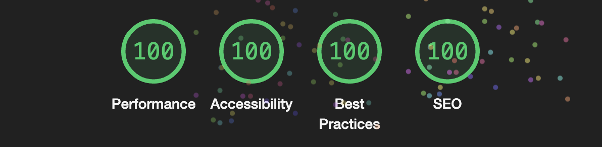

Astro Sphere is a static, minimalist, lightweight, lightning fast portfolio and blog theme based on my personal website.

It is primarily Astro, Tailwind and Typescript, with a very small amount of SolidJS for stateful components.

## 📋 Features

- ✅ 100/100 Lighthouse performance
- ✅ Responsive
- ✅ Accessible
- ✅ SEO-friendly
- ✅ Typesafe
- ✅ Minimal style
- ✅ Light/Dark Theme
- ✅ Animated UI
- ✅ Tailwind styling
- ✅ Auto generated sitemap
- ✅ Auto generated RSS Feed
- ✅ Markdown support
- ✅ MDX Support (components in your markdown)
- ✅ Searchable content (posts and projects)
- ✅ Code Blocks - copy to clipboard

## 💯 Lighthouse score

## 🕊️ Lightweight
All pages under 100kb (including fonts)

## ⚡︎ Fast
Rendered in ~40ms on localhost

## 📄 Configuration
The blog posts on the demo serve as the documentation and configuration.

## ✨ Acknowledgement
Theme inspired by [Paco Coursey](https://paco.me/), [Lee Robinson](https://leerob.io/) and [Hayden Bleasel](https://www.haydenbleasel.com/)

## 🏛️ License
MIT

